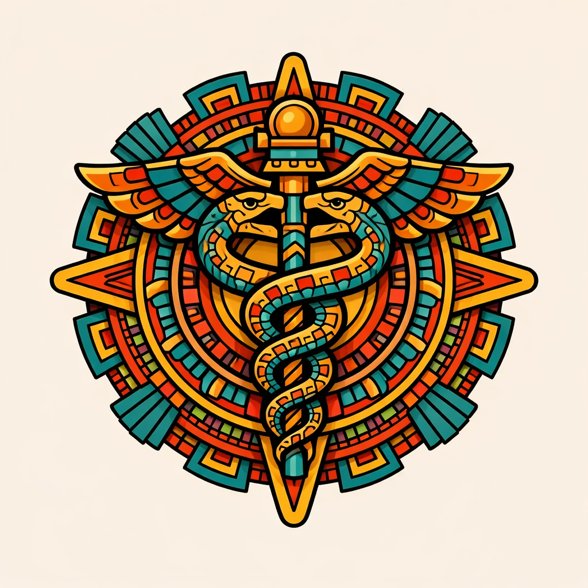

# 🧬 Biomedical Paper Summarizer

<p align="center">
  
</p>

A Streamlit web app that extracts structured insights from full biomedical research papers using the Anthropic Claude API. Upload a PDF (including graphs and figures) or paste plain text and get an instant, structured breakdown — ideal for researchers, students, and anyone navigating dense scientific literature.

---

## Features

- **PDF upload** — extracts full text and renders page images so Claude can analyze graphs, figures, and tables
- **Plain text input** — paste paper text directly as an alternative
- Structured extraction across 6 key dimensions:
  - Research Objective
  - Methods Used
  - Key Findings (with figure references)
  - Drug Targets / Biological Entities
  - Clinical or Research Implications
  - Limitations
- Multimodal analysis via Claude Vision — figures and graphs are included in the analysis
- Clean, professional UI with sidebar configuration
- Secure API key input (never stored)
- Error handling for auth failures and rate limits

---

## Tech Stack

| Layer | Technology |
|---|---|
| Frontend | Streamlit |
| AI / LLM | Anthropic Claude (`claude-sonnet-4-20250514`) |
| PDF Parsing | PyMuPDF |
| Language | Python 3.11 |
| Deployment | Hugging Face Spaces (planned) |

---

## Getting Started

### 1. Clone the repo

```bash
git clone https://github.com/YOUR_USERNAME/biomedical-paper-summarizer.git
cd biomedical-paper-summarizer
```

### 2. Create and activate a virtual environment

```bash
python -m venv venv
# Windows
venv\Scripts\activate
# macOS / Linux
source venv/bin/activate
```

### 3. Install dependencies

```bash
pip install -r requirements.txt
```

### 4. Run the app

```bash
streamlit run app.py
```

### 5. Enter your API key

Get a free API key at [console.anthropic.com](https://console.anthropic.com) and paste it into the sidebar when the app loads.

---

## Project Structure

```
biomedical-paper-summarizer/
├── app.py              # Main Streamlit app
├── requirements.txt    # Python dependencies
├── images/             # Logo and assets
└── README.md
```

---

## About

Built by a Bioinformatics undergrad / Data Science MS student as a portfolio project demonstrating:
- LLM API integration (Anthropic Claude)
- Streamlit application development
- Biomedical NLP use cases

---

## License

MIT
